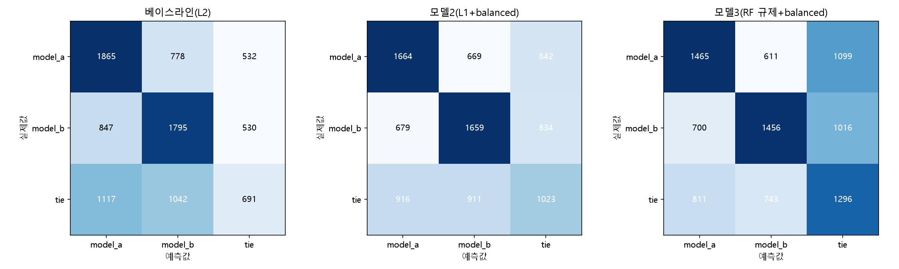
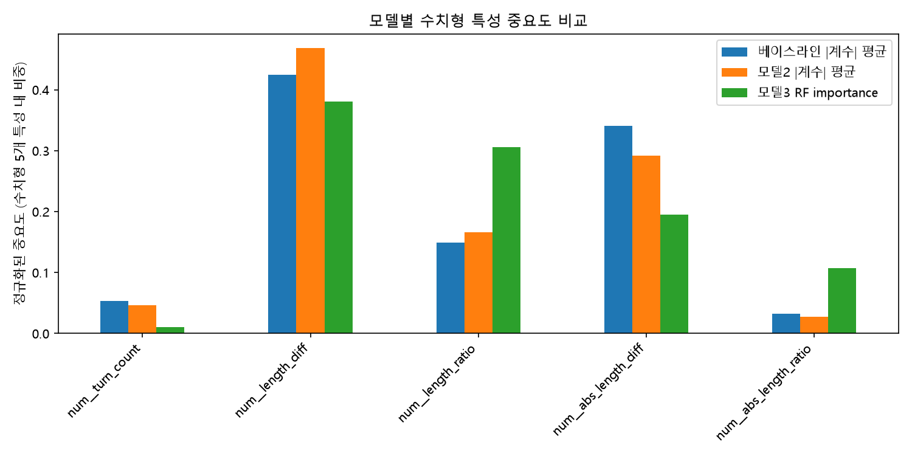

# LMSYS Chatbot Arena 사람의 응답 선호도 예측

동일한 질문에 대한 두 LLM의 응답 중 사람이 어느 쪽을 선호하는지 예측하는 머신러닝 파일럿 프로젝트입니다. 응답 길이, 대화 턴 수, 모델 정보를 활용해 `model_a` 승리 / `model_b` 승리 / `tie`를 분류합니다.

## 데이터

- 사용 데이터: Kaggle **LMSYS - Chatbot Arena Human Preference Predictions**의 `train.csv`
- 규모: 57,477행, 원본 9개 컬럼
- 주요 입력: `model_a`, `model_b`, `prompt`, `response_a`, `response_b`
- 타깃: `winner_model_a`, `winner_model_b`, `winner_tie`를 통합한 `winner`
- 클래스 비율: A 승리 34.91%, B 승리 34.19%, 무승부 30.90%

원본 데이터는 저장소에 포함하지 않습니다. 실행하려면 대회 데이터를 별도로 준비해 노트북과 같은 폴더에 `train.csv`로 배치하세요.

## 분석 과정

1. **탐색적 데이터 분석**: A/B 위치별 승률, 응답 길이와 승패 관계, 대화 턴 수를 살펴봤습니다. 학습 데이터에서 이긴 응답은 진 응답보다 평균적으로 약 20% 길었습니다. 이는 관찰된 연관성이며 길이가 승리의 원인임을 의미하지는 않습니다.
2. **전처리 및 특성 생성**: JSON 형태의 응답을 파싱하고 응답 길이를 IQR 기준으로 클리핑했습니다. 응답 길이 차이, 로그 길이 비율, 각각의 절댓값, 턴 수를 수치형 특성으로 사용했습니다. 모델명은 원-핫 인코딩했습니다.
3. **모델 비교**: 로지스틱 회귀 베이스라인, 클래스 가중치를 적용한 로지스틱 회귀, Random Forest를 비교했습니다.
4. **개선 실험**: GridSearchCV, 가중 Soft Voting, Stacking, 확률 보정, PCA를 실험했습니다. 최종 모델은 로지스틱 회귀와 Random Forest의 예측을 결합하는 Stacking입니다.

## 평가 방법

- 최초 데이터를 학습용 80%, 테스트용 20%로 분리했습니다(`random_state=42`, 층화 추출 미사용).
- 학습용 데이터를 다시 8:2로 나누어 학습 36,784행, 검증 9,197행을 구성했습니다. 테스트는 11,496행입니다.
- 모델 비교와 튜닝에는 검증 세트와 5-fold 교차 검증을 사용했습니다.
- 주요 지표는 **Log Loss**이며, Accuracy와 Macro F1도 함께 확인했습니다.

## 최종 테스트 결과

아래 수치는 노트북에 저장된 실행 결과입니다. Log Loss는 낮을수록, Accuracy와 Macro F1은 높을수록 좋습니다.

| 모델 | Log Loss | Accuracy | Macro F1 |
| --- | ---: | ---: | ---: |
| 로지스틱 회귀 베이스라인 | 1.0163 | 49.10% | 0.4723 |
| 클래스 가중치 적용 로지스틱 회귀 | 1.0179 | 48.90% | **0.4846** |
| Random Forest | 1.0442 | 46.60% | 0.4662 |
| **Stacking (최종)** | **1.0121** | **49.34%** | 0.4814 |

Stacking은 비교 모델 중 테스트 Log Loss와 Accuracy가 가장 좋았습니다. 다만 Macro F1은 클래스 가중치를 적용한 로지스틱 회귀가 더 높았고, Stacking의 무승부 재현율은 약 31%로 개선 여지가 있습니다. PCA는 검증 성능을 떨어뜨려 최종 모델에 적용하지 않았습니다.

## 시각화

노트북의 모델 비교 과정에서 생성한 그래프입니다.

### 혼동 행렬 비교



### 특성 중요도 비교



## 파일 구성

```text
chatbot-arena-pilot/
├── README.md
├── 6기_강주영.ipynb                    # 1~4주차 분석 및 모델링
├── confusion_matrices_comparison.png
├── feature_importance_comparison.png
└── .gitignore
```

## 실행 방법

Python과 Jupyter Notebook 또는 VS Code의 Jupyter 환경을 사용합니다. 주요 라이브러리는 pandas, NumPy, SciPy, scikit-learn, Matplotlib입니다.

```powershell
python -m pip install pandas numpy scipy scikit-learn matplotlib notebook
python -m notebook
```

1. 저장소 폴더에서 위 명령을 실행합니다.
2. 별도로 준비한 `train.csv`를 `6기_강주영.ipynb`와 같은 폴더에 둡니다.
3. 노트북을 열고 위에서부터 분석 셀을 실행합니다.

이 노트북은 실험 기록을 포함합니다. `Stacking + passthrough` 실험은 원본 범주형 입력 때문에 오류가 발생하는 것으로 기록되어 있으므로 해당 셀은 건너뛰세요. PCA 비교 셀의 `proba_before`, `pred_before`는 실행 전에 정의 여부를 확인해야 합니다. 라이브러리 버전이 고정되어 있지 않아 환경에 따라 API 조정이 필요할 수 있습니다. 그래프는 Windows의 `Malgun Gothic` 폰트를 사용하므로 다른 운영체제에서는 설치된 한글 폰트로 변경하세요.

## 한계 및 개선 방향

- 텍스트의 의미를 직접 모델링하지 않고 길이와 모델 정보 중심으로 예측하므로 응답의 정확성이나 질문 적합성을 충분히 반영하지 못합니다.
- 무승부 판별 성능을 높이기 위한 추가 특성과 모델링이 필요합니다.
- 클리핑 경계가 내부 검증 분리 전에 계산되어 있어, 엄밀한 교차 검증을 위해서는 이 과정을 학습 파이프라인 내부로 옮길 필요가 있습니다.
- 향후 텍스트 임베딩 활용, 전처리 파이프라인 정리, 패키지 버전 고정 및 반복 분할 평가로 재현성과 평가 신뢰도를 개선할 수 있습니다.
